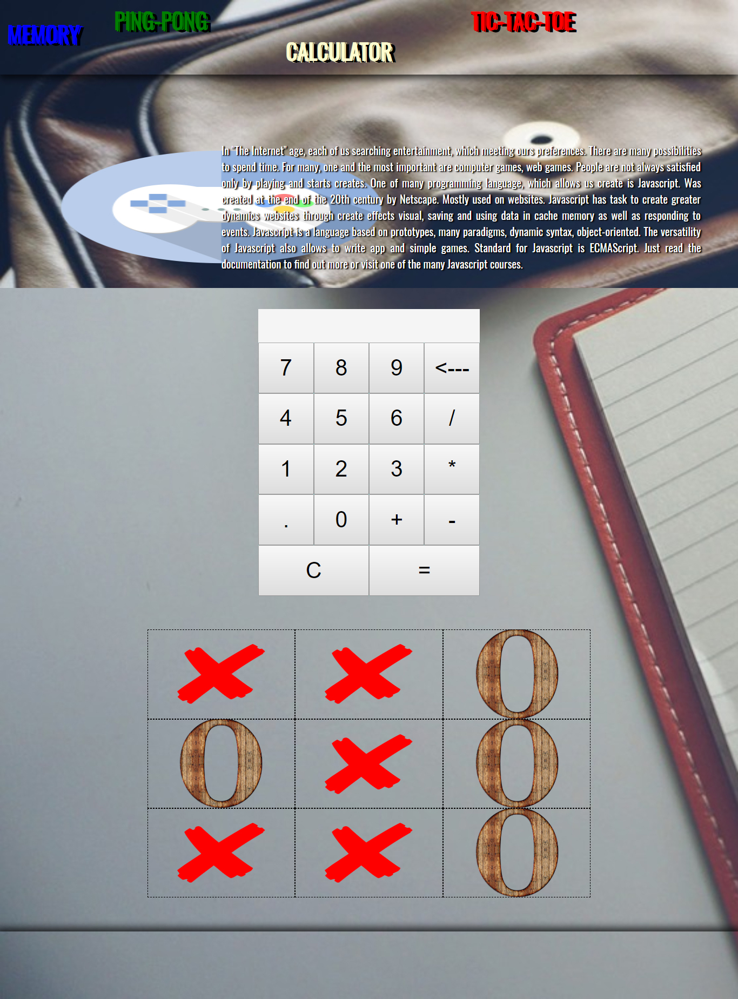

# App, Games with Javascript - cookavsky
**_The way used Javascript to create a personal calculator and a retro game like tic-tac-toe._**

## Table of contents
* [Getting Started](#getting-started)
* [Screenshots](#screenshots)
* [Technologies](#technologies)
* [To do](#to-do)
* [Acknowledgments](#acknowledgments)
* [Status](#status)
* [Author](#author)

## Getting Started
It does not have any requirements. The principle of "copy, paste". In page is 4 application : Memory, Ping-Pong, Calculator and Tic-Tac-Toe. Created only by Javascript, to learn to use it. Calculator and Tic-Tac-Toe are mine.

## Screenshots

## Technologies
* HTML
* CSS
* JS

## To do
* The Appearance

## Acknowledgments
### Memory - Samuraj Programowania
#### Source: https://www.youtube.com/watch?v=gKUUHjEg7mQ

If you speak in Polish language, this tutorial is good for learn write Memory Game.

### Ping - Pong
#### Source: http://blog.atena.pl/pong-pisanie-prostych-gier-2d-w-jezyku-javascript

Inside Source is tutorial, how create simple game Ping - Pong.

### Calculator
#### It is only my knowledge, supported by the Internet

Simple code:
Rule:
* button[3, ] remove last element in content HTML
* button[12, ] add "."
* button[16, ] remove all element
* button[7, 11, 14, 15] save a prievew number
* button[17, ] save a next number and check, which function you click. Performs function and inner Result
* defult: Button, which is number inner to HTML

`
for (let i = 0; i < button.length; i++) {
    button[i].addEventListener("click", function() {
        switch(button[i]) {
            case button[7]:
                if (field.textContent.startsWith(".") === true || field.textContent.endsWith('.') === true) {
                    field.innerHTML = undefined;
                } else {
                    divisionNumber = field.textContent;
                    field.innerHTML = "";
                }
            break;
            case button[11]:
                if (field.textContent.startsWith(".") === true || field.textContent.endsWith('.') === true) {
                    field.innerHTML = undefined;
                } else {
                    multiNumber = field.textContent;
                    field.innerHTML = "";
                }
            break;
            case button[14]:
                if (field.textContent.startsWith(".") === true || field.textContent.endsWith('.') === true) {
                    field.innerHTML = undefined;
                } else {
                    addNumber = field.textContent;
                    field.innerHTML = "";
                }
            break;
            case button[15]:
                if (field.textContent.startsWith(".") === true || field.textContent.endsWith('.') === true) {
                    field.innerHTML = undefined;
                } else {
                    subNumber = field.textContent;
                    field.innerHTML = "";
                }
            break;
            case button[3]:
                const backspace = field.textContent.substr(0, field.textContent.length -1);
                field.innerHTML = backspace;
            break;
            case button[12]:
                if (field.textContent.search(/\./) === -1){
                    Math.round(field.insertAdjacentHTML('beforeend', button[i].value) * 100) / 100};
            break;
            case button[16]:
                field.innerHTML = "";
            break;
            case button[17]:
                let NumberTwo = field.textContent;
                field.innerHTML = "";
                if (divisionNumber >= 0 && divisionNumber.length > 0) {
                    const divisionMath = divisionNumber / NumberTwo;
                    divisionNumber = "";
                    field.innerHTML = divisionMath;
                } else if (multiNumber >= 0 && multiNumber.length > 0) {
                    const multiMath = multiNumber * NumberTwo;
                    multiNumber = "";
                    field.innerHTML = multiMath;
                } else if (addNumber >= 0 && addNumber.length > 0) {
                        const addMath = parseFloat(addNumber) + parseFloat(NumberTwo);
                        addNumber = "";
                        field.innerHTML = addMath;
                } else if (subNumber >= 0 && subNumber.length > 0) {
                        const subMath = subNumber - NumberTwo;
                        subNumber = "";
                        field.innerHTML = subMath;
                }
            break;
            default:
                if(button[i].addEventListener){
                    field.insertAdjacentHTML('beforeend', button[i].value);
                    }
            break;
        }
    })
}`

### Tic-Tac-Toe
#### It is only my knowledge, supported by the Internet

In Brief: I writed all capabilities in js, change img as click and alert, when three same img are near each.

## Status
To improve

## Author
Created by **_cookavsky_** - for friends Polska Panda.
